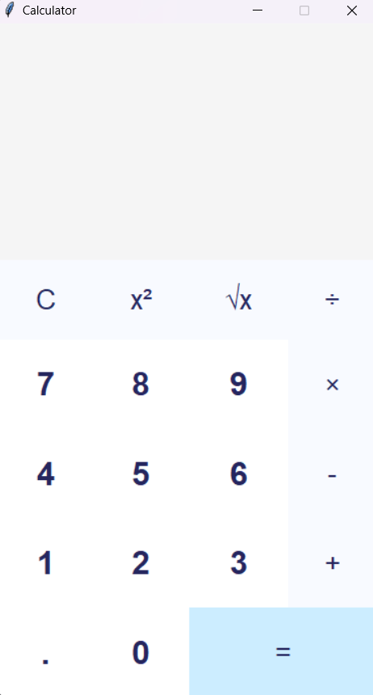

# Calculator using Tkinter

A simple calculator application developed using Python's Tkinter library. The calculator provides a user-friendly interface with basic arithmetic operations, square, and square root functionalities.

## Features

- Addition
- Subtraction
- Multiplication
- Division
- Square
- Square Root

## Requirements

- Python 3.x
- Tkinter (usually comes pre-installed with Python)

## Installation

1. Clone the repository:
    ```bash
    git clone https://github.com/thisis-gp/tkinter_calculator
    ```
   
2. Navigate to the project directory:
    ```bash
    cd tkinter_calculator
    ```

3. Run the calculator:
    ```bash
    python calc.py
    ```

## Usage

1. Enter the numbers and perform arithmetic operations.
2. Use the square and square root buttons for additional functionalities.
3. Click on the 'C' button to clear the current expression.
4. Press the '=' button to evaluate the expression.

## Screenshots



## Contributing

Pull requests are welcome. For major changes, please open an issue first to discuss what you would like to change.

## License

This project is licensed under the MIT License. See the `LICENSE` file for more details.
